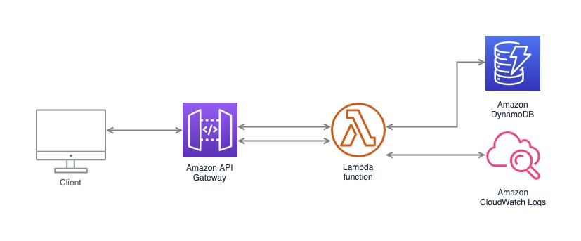

## Setup

Install all dependencies

```
npm install
```

Add your AWS credentials

```
export AWS_ACCESS_KEY_ID=<your-key-here>
export AWS_SECRET_ACCESS_KEY=<your-secret-key-here>
```

## Running Locally

```
npm run start:local
```

## Deploy to AWS
Run the serverless deployment script

```
npm run deploy
```

## Test/Example Requests
Example requests are available in the postman collection `Shell-test.postman_collection.json`

## Basic Architecture


The solution uses serverless (https://serverless.com) to deploy an express server in Lambda that connects to a DynamoDB instance to store and retrieve data. Logging is done using CloudWatch.

## Assumptions
The assumptions made are
- The first arrival cannot be used as a trip as it has no start point
- Any Captains that have only one arrival will have no results returned (as per above assumption)
- Trips will be returned in chronological order
